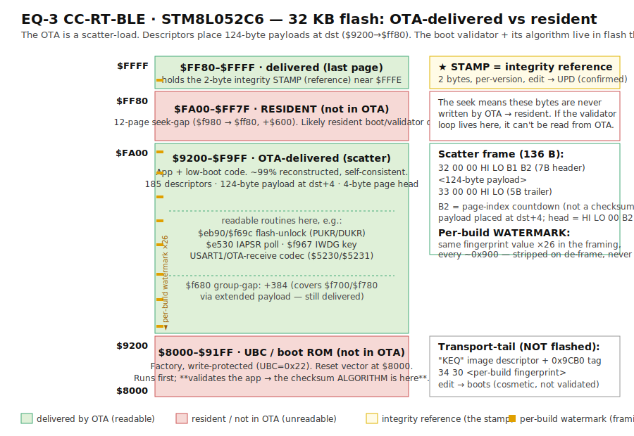

# Reverse engineering the EQ-3 CC-RT-BLE OTA

I extracted the following from the EQ-3 CC-RT-BLE radiator thermostat
firmware update process. The bootloader gates further attacks (boot-time
validator in ROP-protected flash), but the OTA pipeline itself is now
fully understood and the AES-256 key + IV are recoverable.

## What's inside

**AES-256-CBC key (loaded into RAM during OTA):**

```
ad 8e 21 f4 15 03 98 dc a5 b1 75 e5 67 92 b1 40
dc 8a 06 a8 73 d5 06 85 9f 8a ec 7f b0 da 9b e6
```

**Initial IV (also in RAM during OTA):**

```
32 b8 e7 2f 89 08 5b 2a 6a 8b cd f7 05 76 96 ac
```

Each `.enc` record's body starts with its own **16-byte AES-CBC IV**;
decrypt `body[16:]` under it and concatenate to get the plaintext (see the
de-framer below). You *can* also decrypt the whole `.enc` as **one
continuous chain** rooted at `INITIAL_IV` — it yields the identical payload
bytes — but that also decrypts the per-record IV regions and leaves them in
as noise, so for de-framing use the per-record payloads.

## How I got the key

The MCU is an STM8L052C6. Its internal flash is read-out-protected (SWIM
reads of flash return the constant `0x71` filler), but **RAM reads via
SWIM are not blocked**, and the OTA bootloader has to load the key/IV
into RAM in cleartext to do AES-CBC. So:

1. Enter OTA mode by sending `FD A0 ...` over UART (which the bootloader
   waits for after reset).
2. The bootloader then loads the AES key + IV into RAM:
   - Key at `$0010..$002F`
   - Initial IV at `$0062..$0071`
3. Halt the CPU via SWIM (e.g.
   `stm8flash -c stlinkv2 -p stm8l052c6 -s ram -b 2048 -r ram.bin`)
   and just read RAM. The key and IV are sitting there in plain text.

The bootloader code lives in SWIM-blocked flash (reads return `0x71`
filler) so you can't read the binary directly, but it has to load the key
into addressable RAM to use it — and that RAM is readable.

## UART access (BLE chip removal)

The thermostat's STM8L doesn't talk BLE itself — there's a separate BLE
chip on the same board that handles BLE radio and exchanges UART frames
with the STM8L over USART1.

The MCU's USART1 is on **PA2 (TX) / PA3 (RX)**. These nets are
conveniently brought out to two test pads on the PCB labeled **MP1**
and **MP2** — natural attach points for a serial adapter. The catch is
that the BLE chip drives the same UART line whenever it's running, so
anything you transmit on MP1/MP2 collides with the BLE chip's traffic.
To get clean access:

1. Desolder the BLE module from the PCB. (I just tore it off with wire cutters)
2. Wire an FTDI 3.3 V serial adapter to MP1 / MP2.
3. Common GND between FTDI and the device.

After this, OTA frames addressed to the STM8L go straight from the FTDI
to the chip. The OTA bootloader's UART protocol is identical to what the
BLE chip sniffer captured, so the dialog can be replayed and modified at
will.

## OTA wire format

Each `.enc` file is a sequence of length-prefixed records:

```
[len_be:2] [body:len bytes] [crc:2]
```

There are 224–230 records per firmware (varies by version). All bodies
are multiples of 16; almost all are 144 bytes.

The CRC is **CRC-16/CMS**:

- polynomial: `0x8005`
- initial value: `0xFFFF`
- non-reflected (input and output)
- no final XOR

It covers the body only (the bytes between the length prefix and the CRC
trailer), not the length itself. The same CRC variant is used both on
individual OTA chunks and on the higher-level UART frames the bootloader
exchanges (`FD <payload> <crc>`); `0xFD` is a sync byte excluded from
CRC input.

## Flash layout: it's a scatter-load, not a linear image

This one tripped me up for a long time, and I originally got it wrong (an
earlier version of this writeup claimed a "4-byte word rotation" — that was
a mistake; there is **no** rotation, and applying one scrambles real code).

The decrypted stream is **not** a flat image you concatenate at `$8000` —
it's a **relocatable scatter-load**. At a fixed 136-byte period you find
descriptor records:

```
32 00 00 <HI> <LO> <B1> <B2>   (7-byte header)
<124-byte payload>
33 00 00 <HI> <LO>             (5-byte trailer)
```

`HI:LO` is a page-aligned destination address. The targets ramp
`$9200 → $ff80` in steps of `$80` (one 128-byte page), with a few `+$180`
(384) and one `+$600` (1536) "group-gap" jumps. Each 124-byte payload is
placed at its target after a 4-byte page head `HI LO 00 B2` (so the payload
sits at `dst+4`). `B2` is a per-page index countdown (`77 6f 67 … 07`,
resetting every 15-page block), **not** a checksum.

So the runtime image lives at **`$9200..$ff80`**. `$8000..$9200` is the
**UBC** (User Boot Code; write-protected, UBC option byte `0x22`) and is
**not carried in the OTA** — that's where the reset vector and the boot
validator live. A block of high pages (`$fa80..$ff00`, ~1.3 KB) is also
never sent: the `$f980` descriptor's frame holds only ~131 bytes yet its
dst jumps `+1536` to `$ff80`, so the OTA *seeks past* those pages and they
stay resident.



De-framed like this, the code reads as clean STM8 — e.g. the flash-unlock
`35 56 50 52 35 ae 50 52` and the watchdog-key routine `mov $50e0,#$cc`.
(Under the old "rotate every word" model those exact bytes decode to
garbage, which is how I finally realised the rotation model was wrong.)

## What this gets you, what it doesn't

With the AES key + IV + protocol map you can:

- Decrypt every shipped firmware version offline, de-frame the scatter-load
  (see above), and inspect/diff the real runtime image.
- Mint OTA streams that the bootloader accepts (returns `FD A1` commit).
- Read the OTA stream's full plaintext. (The 16-byte chunk headers are just
  the per-record CBC IV bytes — an earlier note that they were "structured
  metadata" / a per-chunk content hash was a dead end; they carry no
  integrity information.)

What you can't easily do (yet) is **boot a modified firmware**. A
boot-time integrity check validates the flashed image before the app
runs and shows `UPD` (refusing to boot) on any modification. The check's
*reference* is a **2-byte per-version value at the very top of flash
(`$FFFE`)**, carried in the OTA — flip a byte of it and the device shows
`UPD`, confirming it's checked. But the *algorithm* that reads it lives in
the resident code the OTA never delivers (the UBC `$8000..$9200`, and/or
the `$fa80..$ff00` seek-gap), so you can't read it or recompute a valid
value without a hardware dump of that region.

## Challenge

If you can figure out how to **boot a forged firmware** on this thing,
I'd love to hear about it. Concretely: produce an `.enc` whose
plaintext is not byte-identical to one of the 10 shipped firmwares,
flash it (the bootloader will commit it — `FD A1` — for almost any
modification), reset, and have the device actually boot the modified
code instead of locking up.

What's known about the wall:

- The validator *algorithm* lives in resident flash the OTA never carries:
  the write-protected UBC (`$8000..$9200`) and/or the `$fa80..$ff00`
  seek-gap. SWIM reads of flash are blocked (return `0x71` filler).
- The reference it compares against is a 2-byte value per firmware version
  at `$FFFE`, embedded in the OTA content — same across devices (per-version,
  not per-device) and identical between the CC-RT-BLE and CC-RT-M-BLE
  variants (whose runtime code is byte-identical).
- The check covers the code (edit any code byte → `UPD`) but not the tail:
  the FF padding, and the `34 30`-prefixed block — which isn't even written
  to flash, it's transport-tail framing — both take edits and still boot.
  That `34 30` block is a **per-build watermark** (it differs between the
  BLE/M variants whose code is byte-identical) — decoration, not the
  reference. The reference is the 2-byte stamp at `$FFFE` (above).
- The reference is **not** any standard checksum. On the *correctly
  de-framed* content, exhaustive sweeps come up empty: CRC-8/16/24/32 (all
  params, via `delsum`), modsum, Fletcher, polyhash; additive-SUM and XOR
  (ruled out by compensation flashes); AES-CBC-MAC / CMAC with the known OTA
  key; and Pearson hashes built from the AES S-box (and its inverse). So it's
  a custom or *keyed* 16-bit function whose secret (algorithm and/or a
  dedicated key) sits in the resident region.
- There are only 6 `(content → reference)` pairs (the shipped versions) and
  the on-device oracle is 1 bit (boot vs `UPD`) — far too little to reverse
  a custom/non-linear 16-bit function blind.
- ROP can't be lifted via SWIM without a mass erase that destroys the
  resident code we'd want to read.

(An earlier version of this section put the validator in `$F1E0..$FFFF` and
described a per-chunk "block-0" content hash with ~13 free bytes. Both were
artifacts of the wrong rotation/sequential reconstruction — not correct.)

Attack surface / open paths:

- **Voltage / clock glitching** at the validator's compare (or at the ROP
  check to lift read protection). I've tried this without success so far —
  it's still the most promising avenue, just not landed yet.
- **Power / EM side-channel** on the validator's checksum computation, to
  recover the algorithm or the reference.
- Note the resident code lives in **flash, not mask ROM**, so decap +
  optical/EM imaging won't read it out (flash stores charge, not physical
  structure) — this isn't a decap-the-ROM situation.

Or some clever software-only thing I'm missing.

## Decrypt example

Minimal Python decrypter (uses `pycryptodome`):

```python
#!/usr/bin/env python3
"""De-frame an EQ-3 CC-RT-BLE .enc OTA into its true runtime flash image.

Scatter-load, NO word rotation. Decrypt the whole .enc as one AES-CBC chain,
then place each descriptor's 124-byte payload at its page-aligned target.
Runtime image spans $9200..$ff80 ($8000..$9200 is the resident UBC).
"""
import binascii, sys
from pathlib import Path
from Crypto.Cipher import AES

KEY = bytes.fromhex(
    'ad8e21f4150398dca5b175e56792b140'
    'dc8a06a873d506859f8aec7fb0da9be6'
)
INITIAL_IV = bytes.fromhex('32b8e72f89085b2a6a8bcdf7057696ac')


def transport_stream(enc_path):
    """Decrypt each record under its own IV (= the first 16 bytes of the body) and
    concatenate the payloads -> the clean scatter stream.

    NB: decrypting the whole .enc as one CBC chain under INITIAL_IV yields the same
    *payload* bytes, but it also decrypts the 16-byte IV regions and leaves them in
    as noise -- which spawns ~24 spurious `32 00 00` descriptor hits and corrupts the
    de-frame. So de-frame the per-record payloads, not the whole-chain output.
    """
    raw = binascii.unhexlify(''.join(enc_path.read_text().split()))
    out = bytearray()
    i = 0
    while i + 2 <= len(raw):
        L = (raw[i] << 8) | raw[i + 1]
        if i + 2 + L > len(raw):
            break
        body = raw[i + 2:i + 2 + L]                 # 16-byte IV | ciphertext | 2-byte CRC
        out += AES.new(KEY, AES.MODE_CBC, body[0:16]).decrypt(body[16:-2])
        i += 2 + L
    return bytes(out)


def deframe(stream):
    """Place each scatter record's payload at its page-aligned dst."""
    def is_hdr(k):
        return (k + 6 < len(stream) and stream[k] == 0x32 and stream[k+1] == 0
                and stream[k+2] == 0
                and 0x9200 <= ((stream[k+3] << 8) | stream[k+4]) <= 0xff80
                and (((stream[k+3] << 8) | stream[k+4]) & 0x7f) == 0)
    flash = bytearray(b'\xff' * 0x10000)
    i = 0
    while i < len(stream) - 6:
        if is_hdr(i):
            dst = (stream[i+3] << 8) | stream[i+4]
            # page head = HI LO 00 B2, then the payload at dst+4
            flash[dst:dst+4] = bytes([stream[i+3], stream[i+4], 0, stream[i+6]])
            j = i + 7                                  # framed payload -> matching trailer
            while j < len(stream) - 5 and not (
                    stream[j] == 0x33 and stream[j+1] == 0 and stream[j+2] == 0
                    and ((stream[j+3] << 8) | stream[j+4]) == dst):
                j += 1
            for k, b in enumerate(stream[i+7:j]):
                if dst + 4 + k < 0x10000:
                    flash[dst+4+k] = b
            k2 = j + 5                                 # group-gap continuation pages
            while k2 < len(stream) - 6 and not is_hdr(k2):
                k2 += 1
            base = dst + 4 + (j - (i + 7))
            for k, b in enumerate(stream[j+5:k2]):
                if base + k < 0x10000:
                    flash[base+k] = b
            i = k2
            continue
        i += 1
    return flash


if __name__ == '__main__':
    enc = Path(sys.argv[1])
    flash = deframe(transport_stream(enc))
    out = Path(sys.argv[2]) if len(sys.argv) > 2 else enc.with_suffix('.bin')
    out.write_bytes(bytes(flash[0x8000:0x10000]))   # $8000-based; $9200..$ff80 meaningful
    print(f'wrote {out}')
```

CRC-16/CMS for crafting your own wire chunks:

```python
def crc16_cms(data, init=0xFFFF, poly=0x8005):
    crc = init
    for b in data:
        crc ^= b << 8
        for _ in range(8):
            crc = ((crc << 1) ^ poly) & 0xFFFF if crc & 0x8000 else (crc << 1) & 0xFFFF
    return crc
```

## Decrypted firmwares

The 10 shipped firmware variants are pre-decrypted in
[`decrypted-stm8/`](decrypted-stm8/) as `.fullpt` files — the raw
continuous AES-CBC plaintext, i.e. the **transport stream before
de-framing** (it still contains the `32 00 00 …` / `33 00 00 …` scatter
descriptors). Useful for protocol-level inspection; de-frame them (see the
code above) to get the `$9200..$ff80` runtime image.

Files:

- `v1.05_CC-RT-BLE.fullpt`
- `v1.06_CC-RT-BLE.fullpt`
- `v1.10_CC-RT-BLE.fullpt`, `v1.10_CC-RT-M-BLE.fullpt`
- `v1.20_CC-RT-BLE.fullpt`, `v1.20_CC-RT-M-BLE.fullpt`
- `v1.46_CC-RT-BLE.fullpt`, `v1.46_CC-RT-M-BLE.fullpt`
- `v1.48_CC-RT-BLE.fullpt`, `v1.48_CC-RT-M-BLE.fullpt`

To get the runtime `.bin`, run the de-framer above on the original `.enc`
(or on a `.fullpt` — feed it to `deframe()` directly, skipping the decrypt
step). There is no rotation and nothing to "strip" — the descriptors are
consumed by the de-framing, and the payloads land at their targets.
